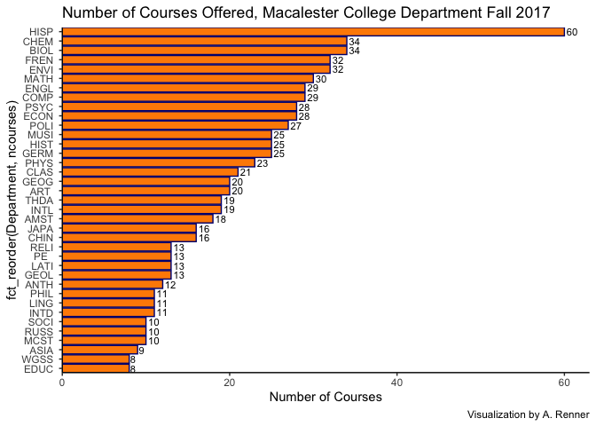

```r
library(tidyverse)     # for data cleaning and plotting
library(gardenR)       # for Lisa's garden data
library(lubridate)     # for date manipulation
library(openintro)     # for the abbr2state() function
library(palmerpenguins)# for Palmer penguin data
library(maps)          # for map data
library(ggmap)         # for mapping points on maps
library(gplots)        # for col2hex() function
library(RColorBrewer)  # for color palettes
library(sf)            # for working with spatial data
library(leaflet)       # for highly customizable mapping
library(ggthemes)      # for more themes (including theme_map())
library(plotly)        # for the ggplotly() - basic interactivity
library(gganimate)     # for adding animation layers to ggplots
library(gifski)        # for creating the gif (don't need to load this library every time,but need it installed)
library(transformr)    # for "tweening" (gganimate)
library(shiny)         # for creating interactive apps
library(patchwork)     # for nicely combining ggplot2 graphs  
library(gt)            # for creating nice tables
library(rvest)         # for scraping data
library(robotstxt)     # for checking if you can scrlape data  
library(readr)
library(stringr)
theme_set(theme_minimal())
```


```r
# Lisa's garden data
data("garden_harvest")

#COVID-19 data from the New York Times
covid19 <- read_csv("https://raw.githubusercontent.com/nytimes/covid-19-data/master/us-states.csv")
```

## Put your homework on GitHub!

My homework is available at [this](https://github.com/arenner108/ExerciseSix) link. 


## Warm-up exercises from tutorial

1. Read in the fake garden harvest data. Find the data [here](https://github.com/llendway/scraping_etc/blob/main/2020_harvest.csv) and click on the `Raw` button to get a direct link to the data. After reading in the data, do one of the quick checks mentioned in the tutorial.
  

```r
uglygardenharvest <- read_csv("uglygardenharvest.csv", 
    col_types = cols(...1 = col_skip(), weight = col_number()), 
    skip = 2)
uglygardenharvest <- uglygardenharvest %>%
  mutate(date = mdy(date))
```


```r
# Checking stuff here and fixing one thing I found because I checked !! 
uglygardenharvest %>% 
  mutate(across(where(is.character), as.factor)) %>% 
  summary()
```

```
##      vegetable                    variety         date           
##  tomatoes :232   grape                : 37   Min.   :2020-06-06  
##  lettuce  : 68   Romanesco            : 34   1st Qu.:2020-07-21  
##  beans    : 38   pickling             : 32   Median :2020-08-09  
##  zucchini : 34   Lettuce Mixture      : 28   Mean   :2020-08-08  
##  cucumbers: 32   Bonny Best           : 26   3rd Qu.:2020-08-26  
##  peas     : 27   Farmer's Market Blend: 26   Max.   :2020-10-03  
##  (Other)  :254   (Other)              :502                       
##      weight       units    
##  Min.   :   2   grams:685  
##  1st Qu.:  87              
##  Median : 252              
##  Mean   : 504              
##  3rd Qu.: 599              
##  Max.   :7350              
##  NA's   :4
```


2. Read in this [data](https://www.kaggle.com/heeraldedhia/groceries-dataset) from the kaggle website. You will need to download the data first. Save it to your project/repo folder. Do some quick checks of the data to assure it has been read in appropriately.


```r
groceries <- read_csv("Groceries_dataset.csv")

groceries %>% 
  mutate(across(where(is.character), as.factor), 
         Date = dmy(Date), 
         Member_number = as.character(Member_number)) %>% 
  summary() 
```

```
##  Member_number           Date                    itemDescription 
##  Length:38765       Min.   :2014-01-01   whole milk      : 2502  
##  Class :character   1st Qu.:2014-07-12   other vegetables: 1898  
##  Mode  :character   Median :2015-01-21   rolls/buns      : 1716  
##                     Mean   :2015-01-09   soda            : 1514  
##                     3rd Qu.:2015-07-10   yogurt          : 1334  
##                     Max.   :2015-12-30   root vegetables : 1071  
##                                          (Other)         :28730
```

```r
#head(groceries) 
# it has been read in correctly 
```


3. Create a table using `gt` with data from your project or from the `garden_harvest` data if your project data aren't ready. Use at least 3 `gt()` functions.


```r
accidentdata <- read_csv("/Users/ameliarenner/Documents/Comp 112/US_Accidents_Dec21_updated.csv")

accidentdata %>% 
  mutate(year = year(Start_Time)) %>%
  na.omit(accidentdata) %>%
  filter(year == "2017") %>%
  filter(City == "Chicago") %>%
  filter(Sunrise_Sunset == "Night") %>%
  mutate(Zipcode = str_sub(Zipcode, end = 5), 
         Date = ymd(str_sub(Start_Time, end = 10)), 
         Weather = Weather_Condition, 
         `Temp (F)` = `Temperature(F)`, 
         `Visibility (mi)` = `Visibility(mi)`) %>%
  select(49, 17, 51, 52, 50) %>%
  gt(
    rowname_col = "Collision Start Time", 
    ) %>%
  tab_header(
    title = md("**2017 Nighttime Vehicle Collisions in Chicago, IL**"),
    subtitle = html("<em>Data available at https://smoosavi.org/datasets/us_accidents</em>")
  ) %>%
  cols_align(
    align = c("center"),
    columns = everything()
) %>%
  opt_table_outline(style = "solid", width = px(3), color = "#D3D3D3") %>%
    opt_table_font(
    font = list(
      google_font(name = "Merriweather"),
      "Cochin", "Serif"
    )
  ) %>%
  fmt_date(
    columns = 1,
      as.Date(Date) <= as_datetime(Date),
    date_style = "day_month"
  )
```

```{=html}
<div id="pechkrnoyb" style="overflow-x:auto;overflow-y:auto;width:auto;height:auto;">
<style>@import url("https://fonts.googleapis.com/css2?family=Merriweather:ital,wght@0,100;0,200;0,300;0,400;0,500;0,600;0,700;0,800;0,900;1,100;1,200;1,300;1,400;1,500;1,600;1,700;1,800;1,900&display=swap");
html {
  font-family: Merriweather, Cochin, Serif, -apple-system, BlinkMacSystemFont, 'Segoe UI', Roboto, Oxygen, Ubuntu, Cantarell, 'Helvetica Neue', 'Fira Sans', 'Droid Sans', Arial, sans-serif;
}

#pechkrnoyb .gt_table {
  display: table;
  border-collapse: collapse;
  margin-left: auto;
  margin-right: auto;
  color: #333333;
  font-size: 16px;
  font-weight: normal;
  font-style: normal;
  background-color: #FFFFFF;
  width: auto;
  border-top-style: solid;
  border-top-width: 3px;
  border-top-color: #D3D3D3;
  border-right-style: solid;
  border-right-width: 3px;
  border-right-color: #D3D3D3;
  border-bottom-style: solid;
  border-bottom-width: 3px;
  border-bottom-color: #D3D3D3;
  border-left-style: solid;
  border-left-width: 3px;
  border-left-color: #D3D3D3;
}

#pechkrnoyb .gt_heading {
  background-color: #FFFFFF;
  text-align: center;
  border-bottom-color: #FFFFFF;
  border-left-style: none;
  border-left-width: 1px;
  border-left-color: #D3D3D3;
  border-right-style: none;
  border-right-width: 1px;
  border-right-color: #D3D3D3;
}

#pechkrnoyb .gt_title {
  color: #333333;
  font-size: 125%;
  font-weight: initial;
  padding-top: 4px;
  padding-bottom: 4px;
  padding-left: 5px;
  padding-right: 5px;
  border-bottom-color: #FFFFFF;
  border-bottom-width: 0;
}

#pechkrnoyb .gt_subtitle {
  color: #333333;
  font-size: 85%;
  font-weight: initial;
  padding-top: 0;
  padding-bottom: 6px;
  padding-left: 5px;
  padding-right: 5px;
  border-top-color: #FFFFFF;
  border-top-width: 0;
}

#pechkrnoyb .gt_bottom_border {
  border-bottom-style: solid;
  border-bottom-width: 2px;
  border-bottom-color: #D3D3D3;
}

#pechkrnoyb .gt_col_headings {
  border-top-style: solid;
  border-top-width: 2px;
  border-top-color: #D3D3D3;
  border-bottom-style: solid;
  border-bottom-width: 2px;
  border-bottom-color: #D3D3D3;
  border-left-style: none;
  border-left-width: 1px;
  border-left-color: #D3D3D3;
  border-right-style: none;
  border-right-width: 1px;
  border-right-color: #D3D3D3;
}

#pechkrnoyb .gt_col_heading {
  color: #333333;
  background-color: #FFFFFF;
  font-size: 100%;
  font-weight: normal;
  text-transform: inherit;
  border-left-style: none;
  border-left-width: 1px;
  border-left-color: #D3D3D3;
  border-right-style: none;
  border-right-width: 1px;
  border-right-color: #D3D3D3;
  vertical-align: bottom;
  padding-top: 5px;
  padding-bottom: 6px;
  padding-left: 5px;
  padding-right: 5px;
  overflow-x: hidden;
}

#pechkrnoyb .gt_column_spanner_outer {
  color: #333333;
  background-color: #FFFFFF;
  font-size: 100%;
  font-weight: normal;
  text-transform: inherit;
  padding-top: 0;
  padding-bottom: 0;
  padding-left: 4px;
  padding-right: 4px;
}

#pechkrnoyb .gt_column_spanner_outer:first-child {
  padding-left: 0;
}

#pechkrnoyb .gt_column_spanner_outer:last-child {
  padding-right: 0;
}

#pechkrnoyb .gt_column_spanner {
  border-bottom-style: solid;
  border-bottom-width: 2px;
  border-bottom-color: #D3D3D3;
  vertical-align: bottom;
  padding-top: 5px;
  padding-bottom: 5px;
  overflow-x: hidden;
  display: inline-block;
  width: 100%;
}

#pechkrnoyb .gt_group_heading {
  padding-top: 8px;
  padding-bottom: 8px;
  padding-left: 5px;
  padding-right: 5px;
  color: #333333;
  background-color: #FFFFFF;
  font-size: 100%;
  font-weight: initial;
  text-transform: inherit;
  border-top-style: solid;
  border-top-width: 2px;
  border-top-color: #D3D3D3;
  border-bottom-style: solid;
  border-bottom-width: 2px;
  border-bottom-color: #D3D3D3;
  border-left-style: none;
  border-left-width: 1px;
  border-left-color: #D3D3D3;
  border-right-style: none;
  border-right-width: 1px;
  border-right-color: #D3D3D3;
  vertical-align: middle;
}

#pechkrnoyb .gt_empty_group_heading {
  padding: 0.5px;
  color: #333333;
  background-color: #FFFFFF;
  font-size: 100%;
  font-weight: initial;
  border-top-style: solid;
  border-top-width: 2px;
  border-top-color: #D3D3D3;
  border-bottom-style: solid;
  border-bottom-width: 2px;
  border-bottom-color: #D3D3D3;
  vertical-align: middle;
}

#pechkrnoyb .gt_from_md > :first-child {
  margin-top: 0;
}

#pechkrnoyb .gt_from_md > :last-child {
  margin-bottom: 0;
}

#pechkrnoyb .gt_row {
  padding-top: 8px;
  padding-bottom: 8px;
  padding-left: 5px;
  padding-right: 5px;
  margin: 10px;
  border-top-style: solid;
  border-top-width: 1px;
  border-top-color: #D3D3D3;
  border-left-style: none;
  border-left-width: 1px;
  border-left-color: #D3D3D3;
  border-right-style: none;
  border-right-width: 1px;
  border-right-color: #D3D3D3;
  vertical-align: middle;
  overflow-x: hidden;
}

#pechkrnoyb .gt_stub {
  color: #333333;
  background-color: #FFFFFF;
  font-size: 100%;
  font-weight: initial;
  text-transform: inherit;
  border-right-style: solid;
  border-right-width: 2px;
  border-right-color: #D3D3D3;
  padding-left: 5px;
  padding-right: 5px;
}

#pechkrnoyb .gt_stub_row_group {
  color: #333333;
  background-color: #FFFFFF;
  font-size: 100%;
  font-weight: initial;
  text-transform: inherit;
  border-right-style: solid;
  border-right-width: 2px;
  border-right-color: #D3D3D3;
  padding-left: 5px;
  padding-right: 5px;
  vertical-align: top;
}

#pechkrnoyb .gt_row_group_first td {
  border-top-width: 2px;
}

#pechkrnoyb .gt_summary_row {
  color: #333333;
  background-color: #FFFFFF;
  text-transform: inherit;
  padding-top: 8px;
  padding-bottom: 8px;
  padding-left: 5px;
  padding-right: 5px;
}

#pechkrnoyb .gt_first_summary_row {
  border-top-style: solid;
  border-top-color: #D3D3D3;
}

#pechkrnoyb .gt_first_summary_row.thick {
  border-top-width: 2px;
}

#pechkrnoyb .gt_last_summary_row {
  padding-top: 8px;
  padding-bottom: 8px;
  padding-left: 5px;
  padding-right: 5px;
  border-bottom-style: solid;
  border-bottom-width: 2px;
  border-bottom-color: #D3D3D3;
}

#pechkrnoyb .gt_grand_summary_row {
  color: #333333;
  background-color: #FFFFFF;
  text-transform: inherit;
  padding-top: 8px;
  padding-bottom: 8px;
  padding-left: 5px;
  padding-right: 5px;
}

#pechkrnoyb .gt_first_grand_summary_row {
  padding-top: 8px;
  padding-bottom: 8px;
  padding-left: 5px;
  padding-right: 5px;
  border-top-style: double;
  border-top-width: 6px;
  border-top-color: #D3D3D3;
}

#pechkrnoyb .gt_striped {
  background-color: rgba(128, 128, 128, 0.05);
}

#pechkrnoyb .gt_table_body {
  border-top-style: solid;
  border-top-width: 2px;
  border-top-color: #D3D3D3;
  border-bottom-style: solid;
  border-bottom-width: 2px;
  border-bottom-color: #D3D3D3;
}

#pechkrnoyb .gt_footnotes {
  color: #333333;
  background-color: #FFFFFF;
  border-bottom-style: none;
  border-bottom-width: 2px;
  border-bottom-color: #D3D3D3;
  border-left-style: none;
  border-left-width: 2px;
  border-left-color: #D3D3D3;
  border-right-style: none;
  border-right-width: 2px;
  border-right-color: #D3D3D3;
}

#pechkrnoyb .gt_footnote {
  margin: 0px;
  font-size: 90%;
  padding-left: 4px;
  padding-right: 4px;
  padding-left: 5px;
  padding-right: 5px;
}

#pechkrnoyb .gt_sourcenotes {
  color: #333333;
  background-color: #FFFFFF;
  border-bottom-style: none;
  border-bottom-width: 2px;
  border-bottom-color: #D3D3D3;
  border-left-style: none;
  border-left-width: 2px;
  border-left-color: #D3D3D3;
  border-right-style: none;
  border-right-width: 2px;
  border-right-color: #D3D3D3;
}

#pechkrnoyb .gt_sourcenote {
  font-size: 90%;
  padding-top: 4px;
  padding-bottom: 4px;
  padding-left: 5px;
  padding-right: 5px;
}

#pechkrnoyb .gt_left {
  text-align: left;
}

#pechkrnoyb .gt_center {
  text-align: center;
}

#pechkrnoyb .gt_right {
  text-align: right;
  font-variant-numeric: tabular-nums;
}

#pechkrnoyb .gt_font_normal {
  font-weight: normal;
}

#pechkrnoyb .gt_font_bold {
  font-weight: bold;
}

#pechkrnoyb .gt_font_italic {
  font-style: italic;
}

#pechkrnoyb .gt_super {
  font-size: 65%;
}

#pechkrnoyb .gt_footnote_marks {
  font-style: italic;
  font-weight: normal;
  font-size: 75%;
  vertical-align: 0.4em;
}

#pechkrnoyb .gt_asterisk {
  font-size: 100%;
  vertical-align: 0;
}

#pechkrnoyb .gt_slash_mark {
  font-size: 0.7em;
  line-height: 0.7em;
  vertical-align: 0.15em;
}

#pechkrnoyb .gt_fraction_numerator {
  font-size: 0.6em;
  line-height: 0.6em;
  vertical-align: 0.45em;
}

#pechkrnoyb .gt_fraction_denominator {
  font-size: 0.6em;
  line-height: 0.6em;
  vertical-align: -0.05em;
}
</style>
<table class="gt_table">
  <thead class="gt_header">
    <tr>
      <th colspan="5" class="gt_heading gt_title gt_font_normal" style><strong>2017 Nighttime Vehicle Collisions in Chicago, IL</strong></th>
    </tr>
    <tr>
      <th colspan="5" class="gt_heading gt_subtitle gt_font_normal gt_bottom_border" style><em>Data available at https://smoosavi.org/datasets/us_accidents</em></th>
    </tr>
  </thead>
  <thead class="gt_col_headings">
    <tr>
      <th class="gt_col_heading gt_columns_bottom_border gt_center" rowspan="1" colspan="1">Date</th>
      <th class="gt_col_heading gt_columns_bottom_border gt_center" rowspan="1" colspan="1">Zipcode</th>
      <th class="gt_col_heading gt_columns_bottom_border gt_center" rowspan="1" colspan="1">Temp (F)</th>
      <th class="gt_col_heading gt_columns_bottom_border gt_center" rowspan="1" colspan="1">Visibility (mi)</th>
      <th class="gt_col_heading gt_columns_bottom_border gt_center" rowspan="1" colspan="1">Weather</th>
    </tr>
  </thead>
  <tbody class="gt_table_body">
    <tr><td class="gt_row gt_center">2 January</td>
<td class="gt_row gt_center">60657</td>
<td class="gt_row gt_center">39.9</td>
<td class="gt_row gt_center">2.0</td>
<td class="gt_row gt_center">Light Drizzle</td></tr>
    <tr><td class="gt_row gt_center">9 January</td>
<td class="gt_row gt_center">60654</td>
<td class="gt_row gt_center">28.0</td>
<td class="gt_row gt_center">1.2</td>
<td class="gt_row gt_center">Light Snow</td></tr>
    <tr><td class="gt_row gt_center">9 January</td>
<td class="gt_row gt_center">60646</td>
<td class="gt_row gt_center">26.1</td>
<td class="gt_row gt_center">1.8</td>
<td class="gt_row gt_center">Light Snow</td></tr>
    <tr><td class="gt_row gt_center">11 January</td>
<td class="gt_row gt_center">60628</td>
<td class="gt_row gt_center">37.0</td>
<td class="gt_row gt_center">3.0</td>
<td class="gt_row gt_center">Thunderstorms and Rain</td></tr>
    <tr><td class="gt_row gt_center">16 January</td>
<td class="gt_row gt_center">60622</td>
<td class="gt_row gt_center">36.0</td>
<td class="gt_row gt_center">0.8</td>
<td class="gt_row gt_center">Light Rain</td></tr>
    <tr><td class="gt_row gt_center">16 January</td>
<td class="gt_row gt_center">60643</td>
<td class="gt_row gt_center">36.0</td>
<td class="gt_row gt_center">1.0</td>
<td class="gt_row gt_center">Rain</td></tr>
    <tr><td class="gt_row gt_center">19 January</td>
<td class="gt_row gt_center">60661</td>
<td class="gt_row gt_center">37.9</td>
<td class="gt_row gt_center">2.5</td>
<td class="gt_row gt_center">Light Rain</td></tr>
    <tr><td class="gt_row gt_center">19 January</td>
<td class="gt_row gt_center">60632</td>
<td class="gt_row gt_center">37.9</td>
<td class="gt_row gt_center">2.0</td>
<td class="gt_row gt_center">Light Rain</td></tr>
    <tr><td class="gt_row gt_center">19 January</td>
<td class="gt_row gt_center">60616</td>
<td class="gt_row gt_center">37.9</td>
<td class="gt_row gt_center">1.5</td>
<td class="gt_row gt_center">Light Rain</td></tr>
    <tr><td class="gt_row gt_center">20 January</td>
<td class="gt_row gt_center">60629</td>
<td class="gt_row gt_center">37.9</td>
<td class="gt_row gt_center">1.8</td>
<td class="gt_row gt_center">Light Rain</td></tr>
    <tr><td class="gt_row gt_center">25 January</td>
<td class="gt_row gt_center">60608</td>
<td class="gt_row gt_center">39.0</td>
<td class="gt_row gt_center">7.0</td>
<td class="gt_row gt_center">Light Rain</td></tr>
    <tr><td class="gt_row gt_center">26 January</td>
<td class="gt_row gt_center">60651</td>
<td class="gt_row gt_center">34.0</td>
<td class="gt_row gt_center">10.0</td>
<td class="gt_row gt_center">Light Snow</td></tr>
    <tr><td class="gt_row gt_center">26 January</td>
<td class="gt_row gt_center">60661</td>
<td class="gt_row gt_center">34.0</td>
<td class="gt_row gt_center">10.0</td>
<td class="gt_row gt_center">Light Snow</td></tr>
    <tr><td class="gt_row gt_center">27 January</td>
<td class="gt_row gt_center">60634</td>
<td class="gt_row gt_center">28.0</td>
<td class="gt_row gt_center">10.0</td>
<td class="gt_row gt_center">Overcast</td></tr>
    <tr><td class="gt_row gt_center">7 February</td>
<td class="gt_row gt_center">60608</td>
<td class="gt_row gt_center">44.1</td>
<td class="gt_row gt_center">1.5</td>
<td class="gt_row gt_center">Light Drizzle</td></tr>
    <tr><td class="gt_row gt_center">7 February</td>
<td class="gt_row gt_center">60616</td>
<td class="gt_row gt_center">45.0</td>
<td class="gt_row gt_center">1.2</td>
<td class="gt_row gt_center">Light Rain</td></tr>
    <tr><td class="gt_row gt_center">23 February</td>
<td class="gt_row gt_center">60643</td>
<td class="gt_row gt_center">39.9</td>
<td class="gt_row gt_center">9.0</td>
<td class="gt_row gt_center">Light Rain</td></tr>
    <tr><td class="gt_row gt_center">1 March</td>
<td class="gt_row gt_center">60609</td>
<td class="gt_row gt_center">32.0</td>
<td class="gt_row gt_center">8.0</td>
<td class="gt_row gt_center">Light Snow</td></tr>
    <tr><td class="gt_row gt_center">4 March</td>
<td class="gt_row gt_center">60649</td>
<td class="gt_row gt_center">28.9</td>
<td class="gt_row gt_center">7.0</td>
<td class="gt_row gt_center">Light Snow</td></tr>
    <tr><td class="gt_row gt_center">13 March</td>
<td class="gt_row gt_center">60616</td>
<td class="gt_row gt_center">30.0</td>
<td class="gt_row gt_center">1.8</td>
<td class="gt_row gt_center">Light Snow</td></tr>
    <tr><td class="gt_row gt_center">14 March</td>
<td class="gt_row gt_center">60618</td>
<td class="gt_row gt_center">21.0</td>
<td class="gt_row gt_center">7.0</td>
<td class="gt_row gt_center">Light Snow</td></tr>
    <tr><td class="gt_row gt_center">17 March</td>
<td class="gt_row gt_center">60651</td>
<td class="gt_row gt_center">36.0</td>
<td class="gt_row gt_center">9.0</td>
<td class="gt_row gt_center">Light Rain</td></tr>
    <tr><td class="gt_row gt_center">24 March</td>
<td class="gt_row gt_center">60618</td>
<td class="gt_row gt_center">44.6</td>
<td class="gt_row gt_center">9.0</td>
<td class="gt_row gt_center">Light Rain</td></tr>
    <tr><td class="gt_row gt_center">24 March</td>
<td class="gt_row gt_center">60604</td>
<td class="gt_row gt_center">44.1</td>
<td class="gt_row gt_center">5.0</td>
<td class="gt_row gt_center">Light Rain</td></tr>
    <tr><td class="gt_row gt_center">24 March</td>
<td class="gt_row gt_center">60619</td>
<td class="gt_row gt_center">43.0</td>
<td class="gt_row gt_center">7.0</td>
<td class="gt_row gt_center">Overcast</td></tr>
    <tr><td class="gt_row gt_center">25 March</td>
<td class="gt_row gt_center">60651</td>
<td class="gt_row gt_center">42.8</td>
<td class="gt_row gt_center">8.0</td>
<td class="gt_row gt_center">Light Rain</td></tr>
    <tr><td class="gt_row gt_center">25 March</td>
<td class="gt_row gt_center">60616</td>
<td class="gt_row gt_center">42.1</td>
<td class="gt_row gt_center">6.0</td>
<td class="gt_row gt_center">Light Rain</td></tr>
    <tr><td class="gt_row gt_center">30 March</td>
<td class="gt_row gt_center">60616</td>
<td class="gt_row gt_center">41.0</td>
<td class="gt_row gt_center">1.2</td>
<td class="gt_row gt_center">Light Drizzle</td></tr>
    <tr><td class="gt_row gt_center">3 April</td>
<td class="gt_row gt_center">60616</td>
<td class="gt_row gt_center">46.0</td>
<td class="gt_row gt_center">1.2</td>
<td class="gt_row gt_center">Light Drizzle</td></tr>
    <tr><td class="gt_row gt_center">5 April</td>
<td class="gt_row gt_center">60642</td>
<td class="gt_row gt_center">41.0</td>
<td class="gt_row gt_center">8.0</td>
<td class="gt_row gt_center">Light Rain</td></tr>
    <tr><td class="gt_row gt_center">6 April</td>
<td class="gt_row gt_center">60640</td>
<td class="gt_row gt_center">39.0</td>
<td class="gt_row gt_center">10.0</td>
<td class="gt_row gt_center">Light Rain</td></tr>
    <tr><td class="gt_row gt_center">29 April</td>
<td class="gt_row gt_center">60616</td>
<td class="gt_row gt_center">45.0</td>
<td class="gt_row gt_center">1.5</td>
<td class="gt_row gt_center">Light Drizzle</td></tr>
    <tr><td class="gt_row gt_center">30 April</td>
<td class="gt_row gt_center">60616</td>
<td class="gt_row gt_center">44.1</td>
<td class="gt_row gt_center">5.0</td>
<td class="gt_row gt_center">Light Drizzle</td></tr>
    <tr><td class="gt_row gt_center">1 November</td>
<td class="gt_row gt_center">60634</td>
<td class="gt_row gt_center">43.0</td>
<td class="gt_row gt_center">6.0</td>
<td class="gt_row gt_center">Overcast</td></tr>
    <tr><td class="gt_row gt_center">13 December</td>
<td class="gt_row gt_center">60605</td>
<td class="gt_row gt_center">30.0</td>
<td class="gt_row gt_center">9.0</td>
<td class="gt_row gt_center">Light Snow</td></tr>
    <tr><td class="gt_row gt_center">29 December</td>
<td class="gt_row gt_center">60621</td>
<td class="gt_row gt_center">15.1</td>
<td class="gt_row gt_center">0.8</td>
<td class="gt_row gt_center">Light Snow</td></tr>
    <tr><td class="gt_row gt_center">17 November</td>
<td class="gt_row gt_center">60614</td>
<td class="gt_row gt_center">46.0</td>
<td class="gt_row gt_center">1.5</td>
<td class="gt_row gt_center">Light Rain</td></tr>
    <tr><td class="gt_row gt_center">28 October</td>
<td class="gt_row gt_center">60643</td>
<td class="gt_row gt_center">37.0</td>
<td class="gt_row gt_center">4.0</td>
<td class="gt_row gt_center">Light Drizzle</td></tr>
  </tbody>
  
  
</table>
</div>
```


4. CHALLENGE (not graded): Write code to replicate the table shown below (open the .html file to see it) created from the `garden_harvest` data as best as you can. When you get to coloring the cells, I used the following line of code for the `colors` argument:
  

```r
# I tried 
# I failed 

# garden_harvest %>%
#  filter(vegetable %in% c("beans", "tomatoes", "carrots")) %>%
#  gt(
#    rowname_col = "date", 
#    groupname_col = "vegetable"
#    ) %>%
#  tab_header(
#    title = md("**Bean, Carrot, and Tomato Harvest (lb)**"),
#  ) %>%
#  cols_align(
#    align = c("center"),
#    columns = everything()
#  ) %>%
#  data_color(
#    columns = everything(), 
#    colors = scales::col_numeric(
#      palette = paletteer::paletteer_d(
#        palette = "RColorBrewer::YlGn"), 
#        domain = NULL)
#       %>% as.character()
#  )
```

  
5. Use `patchwork` operators and functions to combine at least two graphs using your project data or `garden_harvest` data if your project data aren't read.


```r
accidents <- read_csv("/Users/ameliarenner/Documents/Comp 112/US_Accidents_Dec21_updated.csv")

plot1<- accidents %>%
  group_by(Sunrise_Sunset) %>%
  summarize(nightday = n()) %>%
  na.omit(accidents) %>%
  ggplot() + 
  geom_col(aes(y = nightday, x = Sunrise_Sunset), fill = c("#c9ebff", "#7475b6")) + 
  labs(x = "Time of Day", y = "Number of Collisions") + 
    scale_y_continuous(breaks = c(1000000, 2000000, 3000000), limits = c(0, 3000000)) + 
  theme(panel.grid.major.x = element_blank(), panel.grid.minor = element_blank())

plot2<- accidents %>%
  group_by(Junction) %>%
  summarize(junctionn = n()) %>%
  na.omit(accidents) %>%
  ggplot() + 
  geom_col(aes(y = junctionn, x = Junction), fill = c("#c9ebff", "#7475b6")) + 
  labs(y = "", x = "Junction") + 
  scale_x_discrete(labels = c("FALSE" = "Absent", 
                                "TRUE" = "Present")) + 
    scale_y_continuous(breaks = c(1000000, 2000000, 3000000), limits = c(0, 3000000)) + 
  theme(panel.grid.major.x = element_blank(), panel.grid.minor = element_blank(), axis.text.y = element_blank())
  
plot3 <- accidents %>%
  group_by(Crossing) %>%
  summarize(crossingn = n()) %>%
  na.omit(accidents) %>%
  ggplot() + 
  geom_col(aes(y = crossingn, x = Crossing), fill = c("#c9ebff", "#7475b6")) + 
  labs(y = "", x = "Crossing") + 
  scale_x_discrete(labels = c("FALSE" = "Absent", 
                                "TRUE" = "Present")) + 
       scale_y_continuous(breaks = c(1000000, 2000000, 3000000), limits = c(0, 3000000)) + 
  theme(panel.grid.major.x = element_blank(), panel.grid.minor = element_blank(), axis.text.y = element_blank())
  
plot4 <- accidents %>%
  group_by(Give_Way) %>%
  summarize(gwn = n()) %>%
  na.omit(accidents) %>%
  ggplot() + 
  geom_col(aes(y = gwn, x = Give_Way), fill = c("#c9ebff", "#7475b6")) + 
  labs(y = "", x = "Give-Way") + 
  scale_x_discrete(labels = c("FALSE" = "Absent", 
                                "TRUE" = "Present")) + 
      scale_y_continuous(breaks = c(1000000, 2000000, 3000000), limits = c(0, 3000000)) + 
  theme(panel.grid.major.x = element_blank(), panel.grid.minor = element_blank(), axis.text.y = element_blank())
  
plot1 + plot2 + plot3 + plot4 +  
  plot_annotation(title = "Number of US Vehicle Collisions February 2016 - December 2021 by Condition") + 
  plot_layout(ncol = 4)
```


  
## Webscraping exercise (also from tutorial)

Use the data from the [Macalester Registrar's Fall 2017 Class Schedule](https://www.macalester.edu/registrar/schedules/2017fall/class-schedule/#crs10008) to complete all these exercises.

6. Find the correct selectors for the following fields. Make sure that each matches 762 results:

  * **Course Number:** ".class-schedule-course-number"
  * **Course Name:** ".class-schedule-course-title"
  * **Day:** ".class-schedule-course-title+ .class-schedule-label"
  * **Time:** ".class-schedule-label:nth-child(4)"
  * **Room:** ".class-schedule-label:nth-child(5)"
  * **Instructor:** ".class-schedule-label:nth-child(6)"
  * **Avail. / Max:** ".class-schedule-label:nth-child(7)"
  * **General Education Requirements:** "#content p:nth-child(2)" 
  * **Description:** ".collapsed p:nth-child(1)" 

Then, put all this information into one dataset (tibble or data.frame) Do not include any extraneous information like "Instructor: ".


```r
fall2017 <- read_html("https://www.macalester.edu/registrar/schedules/2017fall/class-schedule/#crs10008")

# Course Numbers 
coursenums <- fall2017 %>%
  html_elements(".class-schedule-course-number") %>%
  html_text2()

# Course Names 
coursenames <- fall2017 %>%
  html_elements(".class-schedule-course-title") %>%
  html_text2()

# Course Days 
coursedays <- fall2017 %>%
  html_elements(".class-schedule-course-title+ .class-schedule-label") %>%
  html_text2() %>%
  str_sub(start = 7)

# Course Times 
coursetimes <- fall2017 %>%
  html_elements(".class-schedule-label:nth-child(4)") %>%
  html_text2() %>%
  str_sub(start = 7)

# Course Rooms 
courserooms <- fall2017 %>%
  html_elements(".class-schedule-label:nth-child(5)") %>%
  html_text2() %>%
  str_sub(start = 7)

# Course Instructors 
courseinstructors <- fall2017 %>%
  html_elements(".class-schedule-label:nth-child(6)") %>%
  html_text2() %>%
  str_sub(start = 13)

# Course Avail / Max 
availmax <- fall2017 %>%
  html_elements(".class-schedule-label:nth-child(7)") %>%
  html_text2() %>%
  str_sub(start = 14)

# Course Gen Ed Reqs 
geneds <- fall2017 %>%
  html_elements("#content p:nth-child(2)") %>%
  html_text2() %>%
  str_sub(start = 34)

# Course Descriptions 
descriptions <- fall2017 %>%
  html_elements(".collapsed p:nth-child(1)") %>%
  html_text2()


# Creating variable that's just the 4 letter department code for the following graph I need to make 
# Department 
dept <- fall2017 %>%
  html_elements(".class-schedule-course-number") %>%
  html_text2() %>%
  str_sub(end = 5) %>%
  str_replace_all("1", " ") %>%
  str_replace_all("2", " ") %>%
  str_replace_all("3", " ") %>%
  str_replace_all("4", " ") %>%
  str_replace_all("6", " ") %>%
  str_replace_all("8", " ") %>%
  str_replace_all("0", " ")

course_df <- tibble(Number = coursenums, 
                    Title = coursenames, 
                    Day = coursedays, 
                    Time = coursetimes, 
                    Room = courserooms, 
                    Instructor = courseinstructors,
                    `Avail/Max` = availmax,
                    `Gen Eds` = geneds,
                    Descriptions = descriptions, 
                    Department = dept)
```

7. Create a graph that shows the number of sections offered per department. Hint: The department is a substring of the course number - there are `str_XXX()` functions that can help. Yes, COMP and MATH are the same department, but for this exercise you can just show the results by four letter department code, e.g., with COMP and MATH separate.


```r
# Making a new variable that is the number of courses offered by each department 
coursedf <- course_df %>%
  group_by(Department) %>%
  summarize(ncourses = n())

coursedf %>%
  ggplot(aes(y = fct_reorder(Department, ncourses), x = ncourses)) + 
  geom_col(aes(y = fct_reorder(Department, ncourses), x = ncourses), fill = "#FF8B00", color = "#000080") + # Mac colors, I was feeling artsy
  geom_text(aes(label = ncourses), hjust = -0.2, size = 3) + 
  theme_bw() + 
  coord_cartesian(ylim=c(0,38.5), expand = FALSE) + #gets rid of space between bars and axes 
  coord_cartesian(xlim=c(0,63), expand = FALSE) +
  theme(axis.line = element_line(color='black'),
    plot.background = element_blank(),
    panel.grid.major = element_blank(),
    panel.grid.minor = element_blank(),
    panel.border = element_blank()) + 
  labs(x = "Number of Courses", title = "Number of Courses Offered, Macalester College Department Fall 2017", caption = "Visualization by A. Renner")
```




8. Analyze the typical length of course names by department. To do so, create a new data table based on your courses data table, with the following changes:
  
  * New columns for the length of the title of a course and the length of the description of the course. Hint: `str_length`.  
  * Remove departments that have fewer than 10 sections of courses. To do so, group by department, then remove observations in groups with fewer than 10 sections (Hint: use filter with n()). Then `ungroup()` the data.  
  * Create a visualization of the differences across groups in lengths of course names or course descriptions. Think carefully about the visualization you should be using!


```r
courses <- course_df %>%
  mutate(TitleLength = str_length(Title), 
         DescriptionLength = str_length(Descriptions)) %>%
  group_by(Department) %>%
  mutate(ncourses = n()) %>%
  ungroup() %>%
  filter(ncourses > 10) %>%
  group_by(Department) %>%
  summarize(avglengthtitle = as.numeric(mean(TitleLength)),
            avglengthdesc = as.numeric(mean(DescriptionLength)), 
            titlediff = avglengthdesc - 644)
  
courses %>% 
  ggplot(aes(x = fct_reorder(Department, avglengthdesc), y = titlediff)) +
  geom_col(aes(fill = titlediff<0)) +
  coord_flip() + 
  scale_fill_manual(values=c("#D44420", "#01426A")) +
  theme_minimal() +
  theme(legend.position="none", 
        panel.grid.major.x = element_blank(), # remove the vertical grid lines
        panel.grid.minor.x = element_blank() ,
        panel.grid.major.y = element_line( size=.1, color="gray" )) + 
  labs(x = "Department", 
       title = "Difference in Average Word Count of Fall 2017 Course Descriptions by \nMacalester Department",
       subtitle = "Average word count was 644 words.", 
       y = "Difference in Word Count from Average", 
       caption = "Visualization by A. Renner") 
```


  

